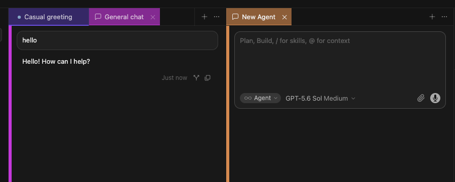

# Cursor Chat Colors

Every Agent chat gets its own color — top tabs and a left accent on the conversation stay in sync so you can switch by color, not by title.



This is a **hack**: it injects CSS/JS into Cursor’s `workbench.html`. It can break after Cursor updates. Use at your own risk.

## Install (macOS)

```bash
git clone https://github.com/TheoDepr/cursor-chat-colors.git
cd cursor-chat-colors
chmod +x cursor-chat-colors
./cursor-chat-colors on
```

Then **fully quit Cursor (`Cmd+Q`)** and reopen. Reload Window is not enough.

Optional — put it on your PATH:

```bash
ln -sfn "$(pwd)/cursor-chat-colors" /usr/local/bin/cursor-chat-colors
```

## Usage

```bash
cursor-chat-colors on         # enable / re-inject
cursor-chat-colors status      # is it on?
cursor-chat-colors reinstall  # after editing css/js
```

After `on` or `reinstall`: **Cmd+Q** and reopen.

## How colors work

- **New chat** → random dark-to-mid tint (wide hue/chroma; avoids hues already on open/recent chats)
- **Same chat forever** → locked to that composer id in `localStorage`
- **Tabs and left accent** → always the same color, including after renames and in split panes

That’s the whole point: scan the tab bar by color, not by title.

## After a Cursor update

If colors disappear or Cursor complains about a corrupt installation:

```bash
./cursor-chat-colors on
```

Then quit and reopen.

## How it works

Cursor doesn’t expose a theming API for Agent chats. This tool inlines `chat-colors.css` + `chat-colors.js` into the workbench HTML (same approach as Custom CSS and JS Loader) and updates `product.json` checksums so Cursor doesn’t complain.
